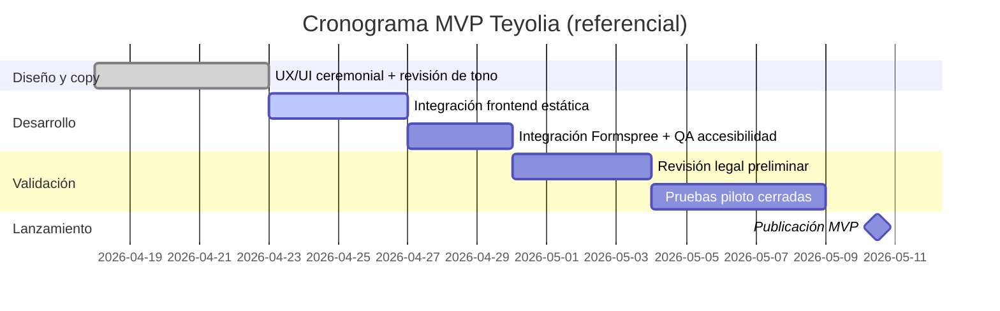

# README_IMPLEMENTACION.md

## MVP Teyolia · Landing de Guardianía Xoloitzcuintle

Esta implementación está diseñada como página independiente (`teyolia.html`) con su propio CSS y JS para poder integrarse después al sitio principal sin contaminar estilos globales.

## 1) Cómo cambiar meta y depósito
Edita `teyolia.js` en `CONFIG.campaign`:

- `goalXec`: meta total de la campaña (actual: `400000000`).
- `depositXec`: depósito requerido para aspirantes (actual: `50000000`).
- `deadline`: fecha de referencia del piloto.

También puedes ajustar:
- `campaign.budgetBreakdown` para desglose conceptual.
- `campaign.pilotCode` para etiqueta de campaña.

## 2) Cómo conectar Formspree
En `teyolia.js` > `CONFIG.wallet`:

- `formspreeStep1`: endpoint del Formspree para pre-postulación.
- `formspreeStep2`: endpoint del Formspree para verificación de depósito.
- ID configurado actualmente: `xbdzegwj` (`https://formspree.io/f/xbdzegwj`).

En `teyolia.html`, ambos formularios incluyen:
- `_subject`
- `_language=es`

### Recomendación
Usar dos endpoints (uno por paso) para separar claramente pre-postulación y verificación de depósito. Si prefieres uno solo, agrega un hidden tipo `etapa` y reutiliza `setupFormSubmission`.

## 3) Cómo reemplazar imágenes
En `teyolia.js` > `CONFIG.puppy.imageUrl` reemplaza el placeholder.

También puedes cambiar directamente el `src` inicial en `teyolia.html` si deseas fallback estático sin JS.

## 4) Cómo conectar backend de verificación
La validación de TXID y dirección en frontend es **soft**. Para verificación real:

- Implementar `POST /api/verify-xec-tx` para validar:
  - existencia del TX,
  - monto,
  - dirección destino,
  - confirmaciones,
  - OP_RETURN (cuando aplique).

Además:
- `GET /api/support-feed` para alimentar apoyos comunitarios.
- `GET /api/applicant-status` para actualizar bandas de validación.
- `POST /api/nft-eligibility` o `GET /api/nft-eligibility` para snapshot de elegibilidad NFT.

## 5) Cómo activar analytics (opcional)
En `setupFormSubmission`, ya hay un hook comentado:

```js
// window.dispatchEvent(new CustomEvent('teyolia_form_success', { detail: { formId } }));
```

Puedes conectarlo a:
- GA4 (eventos custom)
- Segment
- PostHog
- DataLayer propio

Mantener eventos mínimos:
- `teyolia_cta_click`
- `teyolia_form_step1_submit`
- `teyolia_form_step2_submit`
- `teyolia_copy_address`
- `teyolia_txid_validate`

## 6) Comparativa de modelos de campaña

| Modelo | Ventajas | Riesgos | Complejidad operativa | Encaje para piloto |
|---|---|---|---|---|
| A) Aportaciones irrevocables | Simple de ejecutar, caja inmediata | Percepción dura para aspirantes no idóneos, fricción reputacional | Baja | Media |
| B) Aportación comunitaria + depósito con opciones de devolución/saldo | Balance entre seriedad y confianza, mejor narrativa de cuidado | Requiere reglas claras, conciliación y trazabilidad rigurosa | Media | **Alta (recomendada)** |
| C) Reserva competitiva curada | Alta señal de compromiso económico | Riesgo de parecer mercado competitivo, contradicción de tono ceremonial | Media/Alta | Baja |

### Recomendación para el piloto
**Modelo B**. Conserva el principio de responsabilidad, evita estética de competencia y permite una ruta ética para aspirantes no confirmados, siempre que las reglas de tratamiento de depósitos se publiquen con precisión legal.

## 7) Cronograma MVP (Mermaid)



## 8) Legal / jurisdiction flags para revisión con asesoría
- Definir jurisdicción aplicable (actualmente placeholder, no afirmación final).
- Definir tratamiento exacto de depósitos (devolución, saldo, plazos y condiciones).
- Definir política AML/KYC proporcional al riesgo de operación.
- Definir retención de datos personales por categoría y finalidad.
- Definir consentimiento para comunicaciones de seguimiento.
- Definir límites de responsabilidad y términos de campaña.
- Validar redacción pública para evitar interpretación como subasta, rifa o promesa automática.
- Alinear aviso de privacidad integral con legislación aplicable.

## 9) Checklist rápido antes de lanzar
- [ ] Confirmar que `sampleAddress` apunte al enlace oficial de campaña con dirección XEC vigente.
- [ ] Configurar endpoints reales de Formspree.
- [ ] Publicar aviso integral de privacidad y URL final.
- [ ] Confirmar copy legal sobre depósitos.
- [ ] Conectar backend de verificación de TX.
- [ ] Sustituir imagen placeholder por foto oficial del cachorro.
