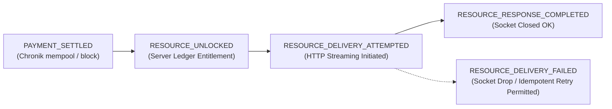

# X402-XR0: Verified Public Xolo Dossier Specification

**Milestone:** `X402-XR0 — Verified Public Xolo Dossier Contract & Offline Harness`  
**Status:** `DESIGN_FROZEN / SPEC_AND_HARNESS_ONLY`  
**Autoridad:** Xolos Ramírez Architecture & Security  
**Ref Arquitectura:** [xr-ac0-architecture.md](file:///home/xolosarmy/.gemini/antigravity-cli/brain/10a6329f-a3e8-434f-be7d-3c3d60c8972c/xr-ac0-architecture.md) (Revision B)

---

## 1. Propuesta de Valor del Recurso

El recurso `Verified Public Xolo Dossier` **NO** es un paywall sobre información pública. La información pública básica de cada cachorro (nombre, foto, edad, variedad, estado y cuidados) permanece 100% abierta y gratuita a través de la web oficial y las herramientas WebMCP (`WM-XR1`).

El valor del **Dossier Verificado** radica en proveer un **paquete estructurado, ensamblado y atestado para consumo por máquinas** (`verified/assembled/attested machine-readable package`):
1. **Compilación integral:** Trazabilidad genealógica estructurada, historial de atestaciones veterinarias, metadatos de linaje y esquemas de compatibilidad agéntica en un único payload JSON canónico firmado por el nodo del criadero.
2. **Atestación de autenticidad:** Digest criptográfico del expediente del ejemplar que previene suplantación en marketplaces o directorios secundarios.
3. **Soporte agéntico:** Diseñado para que agentes autónomos de tutela, seguros de mascotas o registros genealógicos incorporen el historial completo sin raspado HTML frágil.

---

## 2. Contrato HTTP x402 v2 Canónico

### 2.1 Desafío Inicial (402 Payment Required)

Cuando un cliente o agente solicita:
```http
GET /v1/xolos/xilonen/verified-dossier HTTP/1.1
Host: api.xolosramirez.com
Accept: application/json
```

El servidor responde con el desafío formal x402 v2:
```http
HTTP/1.1 402 Payment Required
Content-Type: application/json; charset=utf-8
Cache-Control: no-store

{
  "x402Version": 2,
  "resource": {
    "url": "https://api.xolosramirez.com/v1/xolos/xilonen/verified-dossier",
    "description": "Verified Public Xolo Dossier for Xilonen Ramirez",
    "mimeType": "application/json"
  },
  "accepts": [
    {
      "scheme": "exact",
      "network": "TBD — owned by x402-XEC (candidate: xec:mainnet)",
      "amount": "500000",
      "asset": "TBD — owned by x402-XEC (candidate: XEC)",
      "payTo": "ecash:qp3wjpa3tjlj042z2wv7hahsldgwhwy0rq9sywjpy5",
      "maxTimeoutSeconds": 300,
      "extra": {
        "nonce": "TBD — upstream proposed parameter",
        "issuedAt": 1757786400
      }
    }
  ],
  "extensions": {
    "x402-xec": {
      "info": {
        "resourceHash": "TBD — upstream proposal owned by x402-XEC",
        "invoiceHash": "TBD — upstream proposal owned by x402-XEC",
        "bindingSchema": "TBD — upstream proposal owned by x402-XEC"
      },
      "schema": "https://xolosarmy.xyz/schemas/x402-xec-extension.json"
    }
  }
}
```

### 2.2 Invariantes de Propiedad Upstream
- `network`: Declarado formalmente como **`TBD — owned by x402-XEC`**.
- `asset`: Declarado formalmente como **`TBD — owned by x402-XEC`**.
- Extensiones y bindings (`resourceHash`, `invoiceHash`, `nonce`): Marcados como **`TBD — upstream proposal owned by x402-XEC`** hasta su ratificación en el release canónico de `@x402-xec`.

---

## 3. Modelo de Entitlement Idempotente

El acceso se modela como un **entitlement idempotente**:
$$(\text{txid}, \text{vout}) \longleftrightarrow \text{resourceId} \longleftrightarrow \text{entitlement}$$

1. **Unicidad:** Un pago verificado genera un derecho de acceso (*entitlement*) exclusivo para el recurso canónico solicitado (`resourceId`).
2. **Reintentos seguros:** El cliente puede reintentar la descarga del mismo recurso usando la misma prueba de pago dentro de la política de expiración sin incurrir en cobros adicionales.
3. **Aislamiento inter-recursos:** Una prueba de pago ligada a `xilonen` **NUNCA** puede reutilizarse para desbloquear el expediente de `tlilxochitl` u otro recurso.

---

## 4. Segregación del Ciclo de Vida de Evidencia

Para evitar la falacia de que una transacción en cadena prueba la entrega HTTP, la evidencia se registra en cuatro etapas desacopladas:



- **`PAYMENT_SETTLED`**: Prueba criptográfica de movimiento de valor en la red eCash. Demuestra liquidación financiera, **no** entrega HTTP.
- **`RESOURCE_UNLOCKED`**: Registro en ledger interno del derecho de acceso vinculado al recurso.
- **`RESOURCE_DELIVERY_ATTEMPTED`**: El servidor inicia el envío de la respuesta HTTP 200 con el payload.
- **`RESOURCE_RESPONSE_COMPLETED`**: El transporte concluye la transmisión de bytes y cierra la conexión limpiamente. (No asevera recepción en la aplicación cliente sin un ACK explícito del protocolo superior).
- **`RESOURCE_DELIVERY_FAILED`**: Caída de red o timeout durante la entrega; preserva el *entitlement* para reintento idempotente sin repago.
